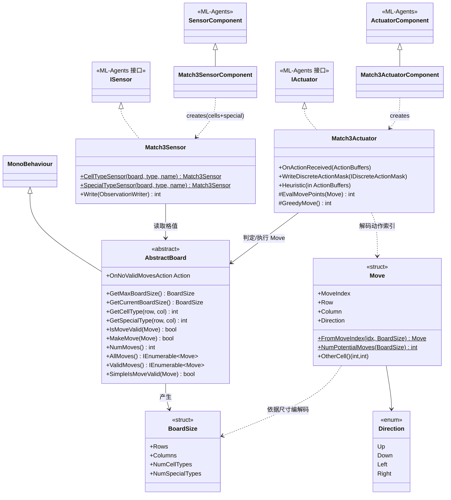
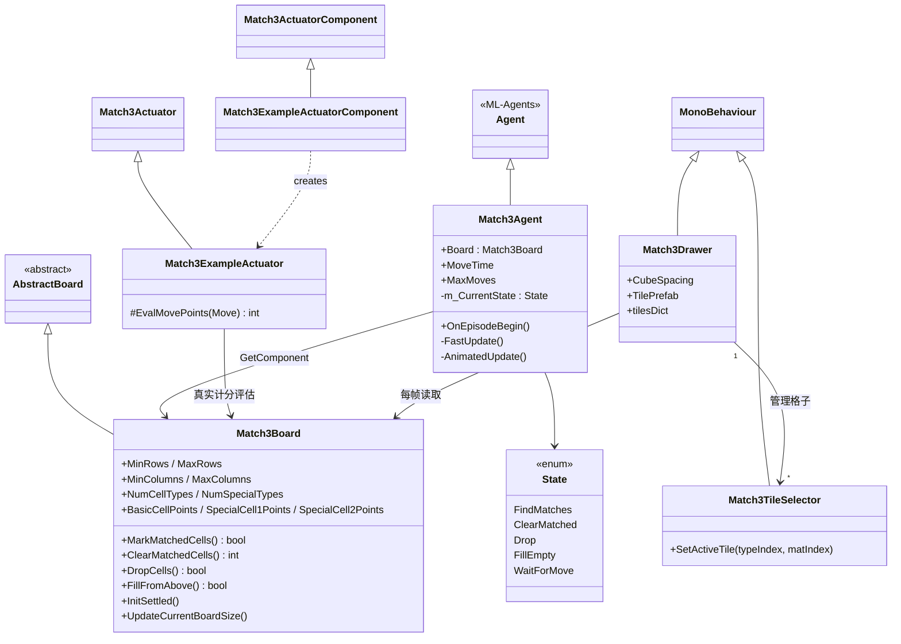

# 02 · 核心类与类图

## 一、类清单与职责

### 集成层（`com.unity.ml-agents/Runtime/Integrations/Match3/`）—— 可复用的 SDK 桥接

| 类 / 结构 | 类型 | 职责 |
| --- | --- | --- |
| `AbstractBoard` | 抽象类（`MonoBehaviour`） | **核心接口**。定义棋盘契约：尺寸、取格类型、判定/执行 move、遍历合法 move。内置 `SimpleIsMoveValid`、`ValidMoves`、`AllMoves`。 |
| `BoardSize` | struct | 描述棋盘维度：`Rows`/`Columns`/`NumCellTypes`/`NumSpecialTypes`，并定义 `<=`/`>=` 比较。 |
| `Move` | struct | **动作的编解码核心**。把"某格 + 方向"的交换 ↔ 一个整数 `MoveIndex` 互转；提供 `FromMoveIndex`/`FromPositionAndDirection`/`Next`/`OtherCell`/`NumPotentialMoves`。 |
| `Direction` | enum | 交换方向：Up/Down/Left/Right。 |
| `Match3Sensor` | `ISensor` | 把棋盘编码成观测（向量 / 视觉），用 `GridValueProvider` 委托读取格值并做 one-hot。 |
| `Match3SensorComponent` | `SensorComponent` | 在 Agent 上生成 Sensor：一个编码颜色（cells）、一个编码特殊类型（special）。 |
| `Match3Actuator` | `IActuator` | 把离散动作索引解码成 `Move` 执行；实现**动作屏蔽** `WriteDiscreteActionMask`；内置贪心启发式 `GreedyMove`。 |
| `Match3ActuatorComponent` | `ActuatorComponent` | 在 Agent 上生成 Actuator，并声明 `ActionSpec`（离散、大小 = 可能 move 数）。 |
| `Match3ObservationType` | enum | 观测形态：`Vector` / `UncompressedVisual` / `CompressedVisual`。 |

### 游戏逻辑层（`Project/.../Examples/Match3/Scripts/`）—— 本示例实现

| 类 | 继承 | 职责 |
| --- | --- | --- |
| `Match3Board` | `AbstractBoard` | 三消规则全实现：棋盘二维数组、匹配 `MarkMatchedCells`、消除计分 `ClearMatchedCells`、下落 `DropCells`、填充 `FillFromAbove`、随机与稳定初始化。支持随机尺寸。 |
| `Match3Agent` | `Agent` | 回合状态机、`FastUpdate`/`AnimatedUpdate` 双节奏、发放奖励、按 `MaxMoves` 截断回合。 |
| `Match3ExampleActuator` | `Match3Actuator` | 重写 `EvalMovePoints`，用真实计分（含特殊格）评估每步价值，让贪心启发式更"聪明"。 |
| `Match3ExampleActuatorComponent` | `Match3ActuatorComponent` | 生成 `Match3ExampleActuator`。 |

### 表现层（纯可视化，不参与决策）

| 类 | 继承 | 职责 |
| --- | --- | --- |
| `Match3Drawer` | `MonoBehaviour` | 每帧读棋盘，实例化/摆放方块；`OnDrawGizmos` 画格子颜色、匹配框、合法 move 连线（调试）。 |
| `Match3TileSelector` | `MonoBehaviour` | 单个格子的显示：按类型激活对应预制体、按颜色索引换材质。 |

---

## 二、类图（分层）

### 2.1 集成层：AbstractBoard 为核心的桥接



### 2.2 游戏逻辑层 + 表现层：本示例的具体实现



---

## 三、一个 GameObject 上的组件组合

Match3 的 Agent 预制体（如 `Match3VectorObs.prefab`）在**同一个 GameObject** 上挂了这些组件，
它们通过 `GetComponent<AbstractBoard>()` 互相找到彼此：

```
Match3 Agent (GameObject)
├── Match3Board                    ← 游戏逻辑（AbstractBoard 实现）
├── Match3Agent                    ← 状态机 + 决策驱动 (Agent)
├── BehaviorParameters             ← 行为名 / 动作空间校验
├── Match3SensorComponent          ← 生成 2 个 Match3Sensor（cells + special）
├── Match3ExampleActuatorComponent ← 生成 Match3ExampleActuator
├── Match3Drawer                   ← 可视化（可选）
└── ModelOverrider                 ← CI 覆盖模型（测试用）
```

> 关键：`Match3SensorComponent` 和 `Match3ExampleActuatorComponent` 都调用
> `GetComponent<AbstractBoard>()` 拿到 `Match3Board`——这就是三层解耦的落地方式：
> **组件之间只通过抽象类 `AbstractBoard` 通信**。

下一篇：[03-观测与动作空间.md](03-观测与动作空间.md)。
