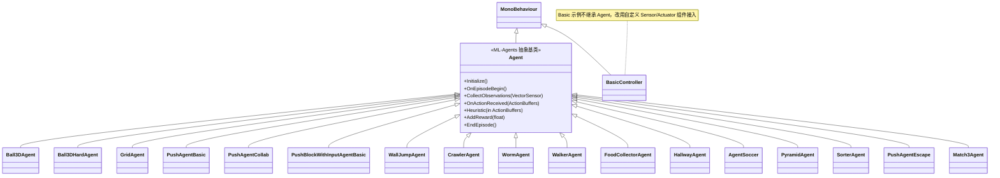
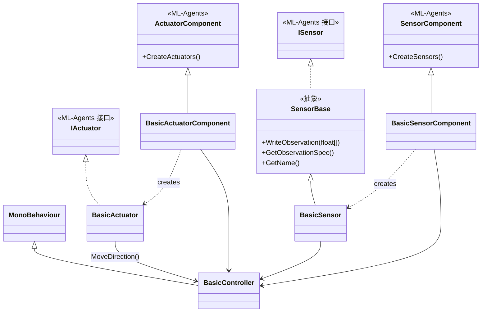
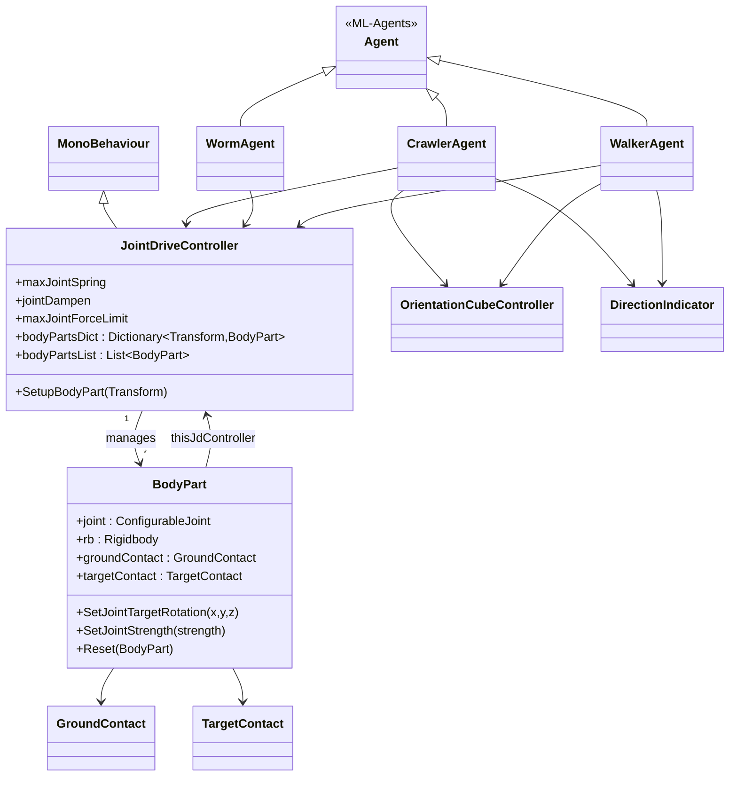
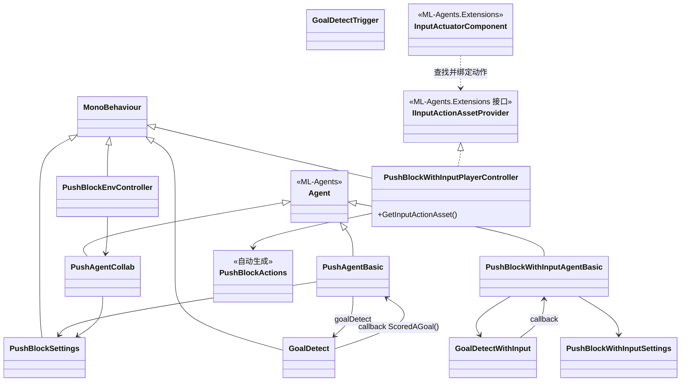
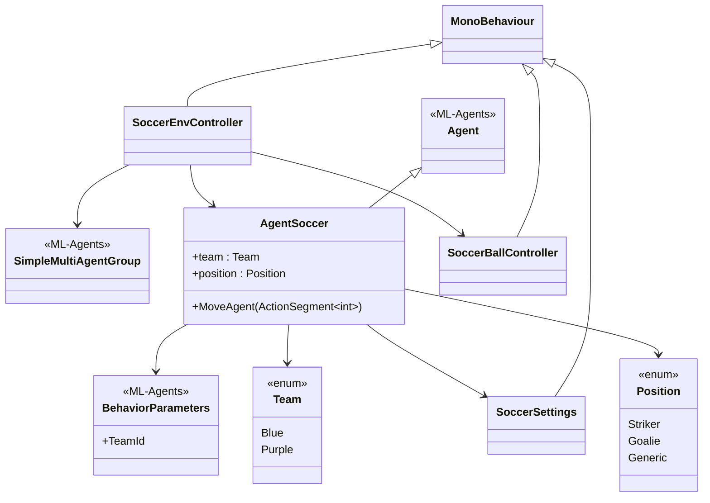
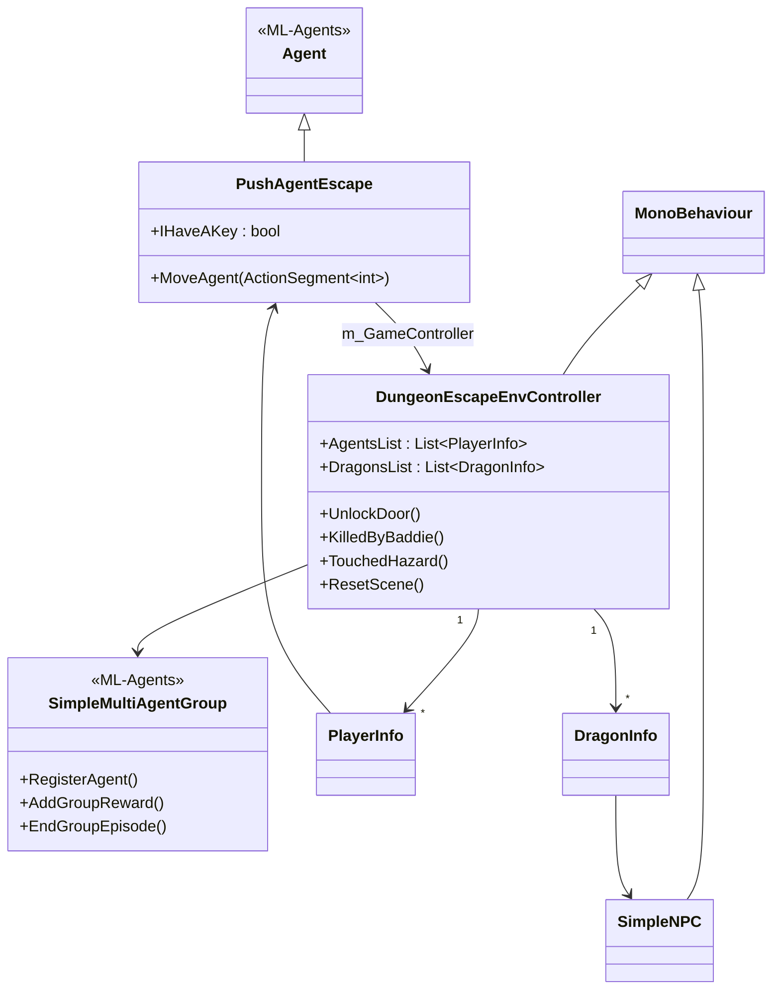
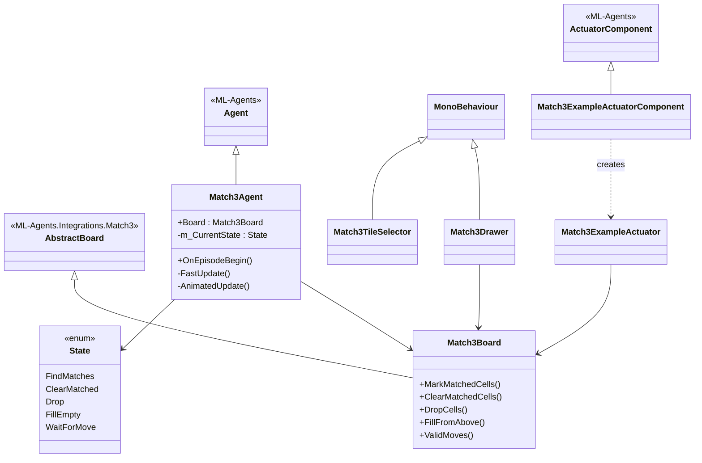
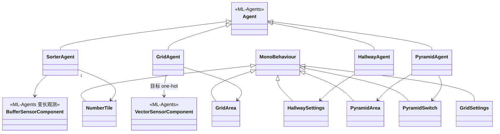

# Project 类图（Unity 端 Examples）

> 本文件用 Mermaid 类图描述 `Project/Assets/ML-Agents/Examples` 下各 Demo 的类结构与关系。
> 为便于阅读，按子系统拆分成多张图。带 `«ML-Agents»` 标注的为 ML-Agents SDK/扩展包提供的基类，其余为示例工程自有类。
>
> 关系约定：`<|--` 继承 / 实现；`-->` 持有引用（关联）；`..>` 依赖/调用。

---

## 1. 总览：Agent 继承体系

所有可训练脚本都继承自 ML-Agents 的 `Agent`（其本身是 Unity 的 `MonoBehaviour`）。

---

## 2. Basic：自定义 Sensor / Actuator（无侵入接入）

演示不继承 `Agent`，通过组件式传感器/执行器把普通 `MonoBehaviour` 接入 ML-Agents。

---

## 3. 关节角色运动（Crawler / Worm / Walker）

三个角色共享 SharedAssets 的关节驱动核心 `JointDriveController` + `BodyPart`，
并使用稳定参考系 `OrientationCubeController` 与朝向指示 `DirectionIndicator`。

---

## 4. PushBlock 家族（含协作版与 Input System 版）

`EnvController` 统管回合与计分，`GoalDetect` 负责进球判定，智能体只做感知与动作。

---

## 5. Soccer：对抗自对弈 + 团队组

---

## 6. DungeonEscape：多智能体协作（MA-POCA 组奖励）

---

## 7. Match3：棋盘型游戏接入 + 状态机

---

## 8. Sorter / GridWorld / Hallway / Pyramids（单智能体 + 特色传感器）

---

## 9. SharedAssets：跨 Demo 复用的支撑类

```mermaid
classDiagram
    class MonoBehaviour

    class ModelOverrider {
        +HasOverrides
        +GetModelForBehaviorName()
    }
    class ProjectSettingsOverrides
    class AdjustTrainingTimescale
    class OrientationCubeController
    class DirectionIndicator
    class GroundContact
    class TargetContact
    class CollisionCallbacks
    class CameraFollow
    class FlyCamera
    class Monitor
    class Area
    class TargetController
    class SensorBase { <<抽象, ISensor>> }

    MonoBehaviour <|-- ModelOverrider
    MonoBehaviour <|-- ProjectSettingsOverrides
    MonoBehaviour <|-- AdjustTrainingTimescale
    MonoBehaviour <|-- OrientationCubeController
    MonoBehaviour <|-- DirectionIndicator
    MonoBehaviour <|-- GroundContact
    MonoBehaviour <|-- TargetContact
    MonoBehaviour <|-- CollisionCallbacks
    MonoBehaviour <|-- CameraFollow
    MonoBehaviour <|-- FlyCamera
    MonoBehaviour <|-- Monitor
    MonoBehaviour <|-- Area
    MonoBehaviour <|-- TargetController

    note for ModelOverrider "供 WallJump 多模型切换、CI 自动化回归测试使用"
    note for GroundContact "被 JointDriveController.BodyPart 复用做着地检测"
```

